```python
#Reading files

import pandas as pd

links_df = pd.read_csv('links.csv')
movies_df= pd.read_csv('movies.csv')
ratings_df = pd.read_csv('ratings.csv')
tags_df = pd.read_csv('tags.csv')
```


```python
#Basic statistics of Movies file

movies_df.describe()

```


<div>
<style>
    .dataframe thead tr:only-child th {
        text-align: right;
    }

    .dataframe thead th {
        text-align: left;
    }

    .dataframe tbody tr th {
        vertical-align: top;
    }
</style>
<table border="1" class="dataframe">
  <thead>
    <tr style="text-align: right;">
      <th></th>
      <th>movieId</th>
    </tr>
  </thead>
  <tbody>
    <tr>
      <th>count</th>
      <td>9742.000000</td>
    </tr>
    <tr>
      <th>mean</th>
      <td>42200.353623</td>
    </tr>
    <tr>
      <th>std</th>
      <td>52160.494854</td>
    </tr>
    <tr>
      <th>min</th>
      <td>1.000000</td>
    </tr>
    <tr>
      <th>25%</th>
      <td>3248.250000</td>
    </tr>
    <tr>
      <th>50%</th>
      <td>7300.000000</td>
    </tr>
    <tr>
      <th>75%</th>
      <td>76232.000000</td>
    </tr>
    <tr>
      <th>max</th>
      <td>193609.000000</td>
    </tr>
  </tbody>
</table>
</div>


```python
#Checking if the Movies file has any null value

movies_df.isnull().any()
```


    movieId    False
    title      False
    genres     False
    dtype: bool


```python
#Length of Unique genres in Movies file

unique_genre=movies_df['genres'].unique().tolist() #If each combination is a unique genre
len(unique_genre)
```


    951


```python
#define a function that counts the number of times each genre appear:

def count_word(df, ref_col, liste):
    keyword_count = dict()
    for s in liste: keyword_count[s] = 0
    for liste_keywords in df[ref_col].str.split('|'):
        if type(liste_keywords) == float and pd.isnull(liste_keywords): continue
        for s in liste_keywords: 
            if pd.notnull(s): keyword_count[s] += 1
    # convert the dictionary in a list to sort the keywords  by frequency
    keyword_occurences = []
    for k,v in keyword_count.items():
        keyword_occurences.append([k,v])
    keyword_occurences.sort(key = lambda x:x[1], reverse = True)
    return keyword_occurences, keyword_count

#here we  make census of the genres:
genre_labels = set()
for s in movies_df['genres'].str.split('|').values:
    genre_labels = genre_labels.union(set(s))

#counting how many times each of genres occur:
keyword_occurences, dum = count_word(movies_df, 'genres', genre_labels)

```


```python
import matplotlib.pyplot as plt # data visualization library
from wordcloud import WordCloud, STOPWORDS #used to generate world cloud


# Function that control the color of the words
def random_color_func(word=None, font_size=None, position=None,
                      orientation=None, font_path=None, random_state=None):
    h = int(360.0 * tone / 255.0)
    s = int(100.0 * 255.0 / 255.0)
    l = int(100.0 * float(random_state.randint(70, 120)) / 255.0)
    return "hsl({}, {}%, {}%)".format(h, s, l)


#Finally, the result is shown as a wordcloud:
words = dict()
trunc_occurences = keyword_occurences[0:50]
for s in trunc_occurences:
    words[s[0]] = s[1]
tone = 100 # define the color of the words
f, ax = plt.subplots(figsize=(14, 6))
wordcloud = WordCloud(width=550,height=300, background_color='black', 
                      max_words=1628,relative_scaling=0.7,
                      color_func = random_color_func,
                      normalize_plurals=False)
wordcloud.generate_from_frequencies(words)
plt.imshow(wordcloud, interpolation="bilinear")
plt.axis('off')
plt.show()
```


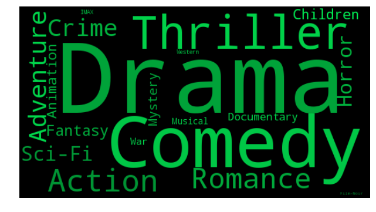


```python
#displaying the same result in the histogram

fig = plt.figure(1, figsize=(18,13))
ax2 = fig.add_subplot(2,1,2)
y_axis = [i[1] for i in trunc_occurences]
x_axis = [k for k,i in enumerate(trunc_occurences)]
x_label = [i[0] for i in trunc_occurences]
plt.xticks(rotation=85, fontsize = 15)
plt.yticks(fontsize = 15)
plt.xticks(x_axis, x_label)
plt.ylabel("No. of occurences", fontsize = 24, labelpad = 0)
ax2.bar(x_axis, y_axis, align = 'center', color='r')
plt.title("Popularity of Genres",bbox={'facecolor':'k', 'pad':5},color='w',fontsize = 30)
plt.show()
```


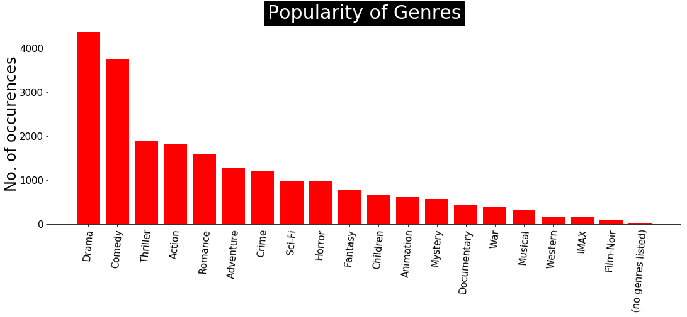


```python
#Basic statistics of Ratings file

ratings_df.describe()
```


<div>
<style>
    .dataframe thead tr:only-child th {
        text-align: right;
    }

    .dataframe thead th {
        text-align: left;
    }

    .dataframe tbody tr th {
        vertical-align: top;
    }
</style>
<table border="1" class="dataframe">
  <thead>
    <tr style="text-align: right;">
      <th></th>
      <th>userId</th>
      <th>movieId</th>
      <th>rating</th>
      <th>timestamp</th>
    </tr>
  </thead>
  <tbody>
    <tr>
      <th>count</th>
      <td>100836.000000</td>
      <td>100836.000000</td>
      <td>100836.000000</td>
      <td>1.008360e+05</td>
    </tr>
    <tr>
      <th>mean</th>
      <td>326.127564</td>
      <td>19435.295718</td>
      <td>3.501557</td>
      <td>1.205946e+09</td>
    </tr>
    <tr>
      <th>std</th>
      <td>182.618491</td>
      <td>35530.987199</td>
      <td>1.042529</td>
      <td>2.162610e+08</td>
    </tr>
    <tr>
      <th>min</th>
      <td>1.000000</td>
      <td>1.000000</td>
      <td>0.500000</td>
      <td>8.281246e+08</td>
    </tr>
    <tr>
      <th>25%</th>
      <td>177.000000</td>
      <td>1199.000000</td>
      <td>3.000000</td>
      <td>1.019124e+09</td>
    </tr>
    <tr>
      <th>50%</th>
      <td>325.000000</td>
      <td>2991.000000</td>
      <td>3.500000</td>
      <td>1.186087e+09</td>
    </tr>
    <tr>
      <th>75%</th>
      <td>477.000000</td>
      <td>8122.000000</td>
      <td>4.000000</td>
      <td>1.435994e+09</td>
    </tr>
    <tr>
      <th>max</th>
      <td>610.000000</td>
      <td>193609.000000</td>
      <td>5.000000</td>
      <td>1.537799e+09</td>
    </tr>
  </tbody>
</table>
</div>


```python
#Check if there is any null value in Ratings file

ratings_df.isnull().any()
```


    userId       False
    movieId      False
    rating       False
    timestamp    False
    dtype: bool


```python
#Average ratings per user

import numpy as np


dftmp = ratings_df[['userId','rating']].groupby('userId').mean()
# Plot histogram
dftmp.plot(kind='hist', bins=50, grid=0, normed=True, edgecolor='black', figsize=(10,5))
# Plot cumulative function on top (couldn't do any other way)
# evaluate the histogram
values, base = np.histogram(dftmp, bins=40, normed=True)
# evaluate the cumulative (multiply by the average distance between points in the x-axis to get UNIT area)
cumulative = np.cumsum(values) * np.diff(base).mean()
# plot the cumulative function
plt.plot(base[:-1], cumulative, c='blue', label='CDF')
plt.xlim(0,5)
plt.legend()
plt.xlabel ('Average movie rating')
plt.ylabel ('Normalized frequency')
plt.title ('Average ratings per user')
plt.show()


```


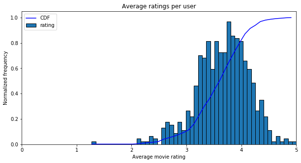


```python
#Basic statistics on Number of times an user has rated movies

ratings_count=ratings_df.groupby('userId').size().reset_index(name='counts')


counts=[]
for i in range(0,len(ratings_count)):
    counts.append(ratings_count['counts'][i])

print("Minimum number of times an user has rated movies:",min(counts))
print("Maximum number of times an user has rated movies:",max(counts))
print("Average number of times an user has rated movies:",np.mean(counts))
print("Average number of times an user has rated movies:",np.median(counts))
print("Standard deviation:", np.std(counts))

```

    Minimum number of times an user has rated movies: 20
    Maximum number of times an user has rated movies: 2698
    Average number of times an user has rated movies: 165.304918033
    Average number of times an user has rated movies: 70.5
    Standard deviation: 269.259608061
    


```python
#Basic statistics of Tags file

tags_df.describe()
```


<div>
<style>
    .dataframe thead tr:only-child th {
        text-align: right;
    }

    .dataframe thead th {
        text-align: left;
    }

    .dataframe tbody tr th {
        vertical-align: top;
    }
</style>
<table border="1" class="dataframe">
  <thead>
    <tr style="text-align: right;">
      <th></th>
      <th>userId</th>
      <th>movieId</th>
      <th>timestamp</th>
    </tr>
  </thead>
  <tbody>
    <tr>
      <th>count</th>
      <td>3683.000000</td>
      <td>3683.000000</td>
      <td>3.683000e+03</td>
    </tr>
    <tr>
      <th>mean</th>
      <td>431.149335</td>
      <td>27252.013576</td>
      <td>1.320032e+09</td>
    </tr>
    <tr>
      <th>std</th>
      <td>158.472553</td>
      <td>43490.558803</td>
      <td>1.721025e+08</td>
    </tr>
    <tr>
      <th>min</th>
      <td>2.000000</td>
      <td>1.000000</td>
      <td>1.137179e+09</td>
    </tr>
    <tr>
      <th>25%</th>
      <td>424.000000</td>
      <td>1262.500000</td>
      <td>1.137521e+09</td>
    </tr>
    <tr>
      <th>50%</th>
      <td>474.000000</td>
      <td>4454.000000</td>
      <td>1.269833e+09</td>
    </tr>
    <tr>
      <th>75%</th>
      <td>477.000000</td>
      <td>39263.000000</td>
      <td>1.498457e+09</td>
    </tr>
    <tr>
      <th>max</th>
      <td>610.000000</td>
      <td>193565.000000</td>
      <td>1.537099e+09</td>
    </tr>
  </tbody>
</table>
</div>


```python
#check if Tags file has null values

tags_df.isnull().any()
```


    userId       False
    movieId      False
    tag          False
    timestamp    False
    dtype: bool


```python
#Basic statistics on Number of times an user has tagged movies

tags_count=tags_df.groupby('userId').size().reset_index(name='counts')


counts2=[]
for i in range(0,len(tags_count)):
    counts2.append(tags_count['counts'][i])

print("Minimum number of times an user has tagged movies:",min(counts2))
print("Maximum number of times an user has tagged movies:",max(counts2))
print("Average number of times an user has tagged movies:",np.mean(counts2))
print("Median number of times an user has tagged movies:",np.median(counts2))
print("Standard deviation:",np.std(counts2))
```

    Minimum number of times an user has tagged movies: 1
    Maximum number of times an user has tagged movies: 1507
    Average number of times an user has tagged movies: 63.5
    Median number of times an user has tagged movies: 4.0
    Standard deviation: 213.255573562
    


```python
#Word cloud for tagged movies

import numpy as np # linear algebra
import pandas as pd 
import matplotlib as mpl
import matplotlib.pyplot as plt
%matplotlib inline

from subprocess import check_output
from wordcloud import WordCloud, STOPWORDS

#mpl.rcParams['figure.figsize']=(8.0,6.0)    #(6.0,4.0)
mpl.rcParams['font.size']=12                #10 
mpl.rcParams['savefig.dpi']=100             #72 
mpl.rcParams['figure.subplot.bottom']=.1 


stopwords = set(STOPWORDS)


# wordcloud = WordCloud(
#                          ).generate(str(tags_df['tag']))

wordcloud = WordCloud(max_font_size=50, max_words=100, background_color="white").generate(str(tags_df['tag']))

print(wordcloud)
fig = plt.figure(1)
plt.imshow(wordcloud)
plt.axis('off')
plt.show()


```

    <wordcloud.wordcloud.WordCloud object at 0x00000209309DA400>
    


```python
#Word cloud for tags of each genre

movie_tags=movies_df.merge(tags_df,on = 'movieId',how = 'inner')

genres_list=['Action','Adventure','Animation','Children','Comedy','Crime','Documentary','Drama','Fantasy','Film-Noir','Horror','Musical','Mystery','Romance','Sci-Fi','Thriller','War','Western']


for i in genres_list:
    print(i)
    drama_movies=movie_tags['genres'].str.contains(i)
    movie_tags[drama_movies].head()
    wordcloud = WordCloud(max_font_size=50, max_words=100, background_color="white").generate(str(movie_tags[drama_movies]['tag']))
    print(wordcloud)
    fig = plt.figure(1)
    plt.imshow(wordcloud)
    plt.axis('off')
    plt.show()

```

    Action
    <wordcloud.wordcloud.WordCloud object at 0x0000020930B984A8>
    


    Adventure
    <wordcloud.wordcloud.WordCloud object at 0x0000020930C3EA20>
    


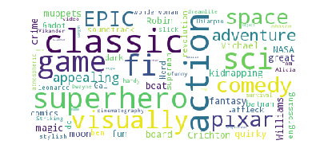


    Animation
    <wordcloud.wordcloud.WordCloud object at 0x0000020930C7DAC8>
    


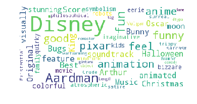


    Children
    <wordcloud.wordcloud.WordCloud object at 0x0000020930D59C88>
    


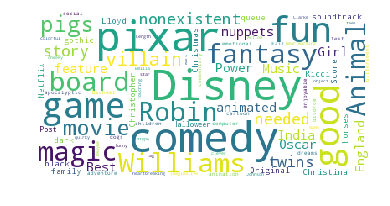


    Comedy
    <wordcloud.wordcloud.WordCloud object at 0x0000020930BDCD30>
    


    Crime
    <wordcloud.wordcloud.WordCloud object at 0x0000020930999A90>
    


    Documentary
    <wordcloud.wordcloud.WordCloud object at 0x0000020930A29470>
    


    Drama
    <wordcloud.wordcloud.WordCloud object at 0x0000020930E12EF0>
    


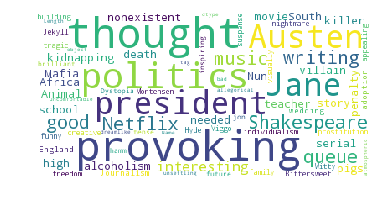


    Fantasy
    <wordcloud.wordcloud.WordCloud object at 0x0000020930D59860>
    


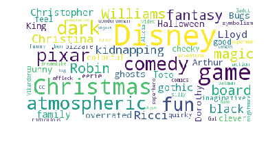


    Film-Noir
    <wordcloud.wordcloud.WordCloud object at 0x0000020930C9FF28>
    


    Horror
    <wordcloud.wordcloud.WordCloud object at 0x0000020930A6C550>
    


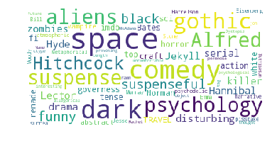


    Musical
    <wordcloud.wordcloud.WordCloud object at 0x0000020930E66CF8>
    


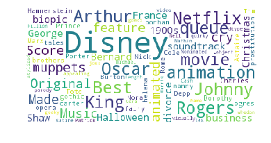


    Mystery
    <wordcloud.wordcloud.WordCloud object at 0x0000020932311160>
    


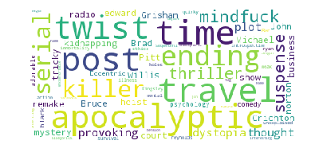


    Romance
    <wordcloud.wordcloud.WordCloud object at 0x00000209323E77B8>
    


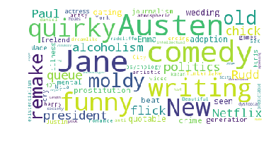


    Sci-Fi
    <wordcloud.wordcloud.WordCloud object at 0x000002093247ADD8>
    


    Thriller
    <wordcloud.wordcloud.WordCloud object at 0x00000209323115F8>
    


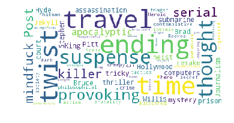


    War
    <wordcloud.wordcloud.WordCloud object at 0x000002093097D080>
    


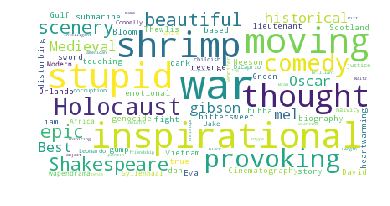


    Western
    <wordcloud.wordcloud.WordCloud object at 0x0000020930A4B7F0>
    


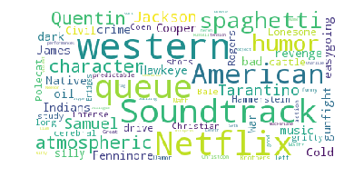


```python

```
